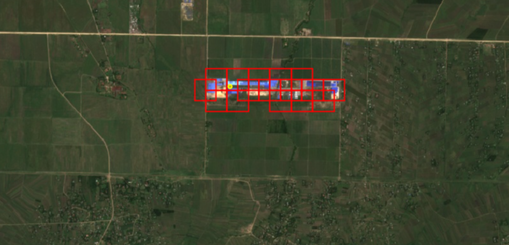

# gcp-sim-search

Enabling similarity search on vector features using [Google's Satellite Embeddings](https://developers.google.com/earth-engine/datasets/catalog/GOOGLE_SATELLITE_EMBEDDING_V1_ANNUAL) (Embedding Fields Model data).

Two main services this will provide:
1. Creates a search-enabled BQ table from an input table 
2. Vector search function

Both services can be deployed as serverless API endpoints. 

See notebooks for walkthroughs.

